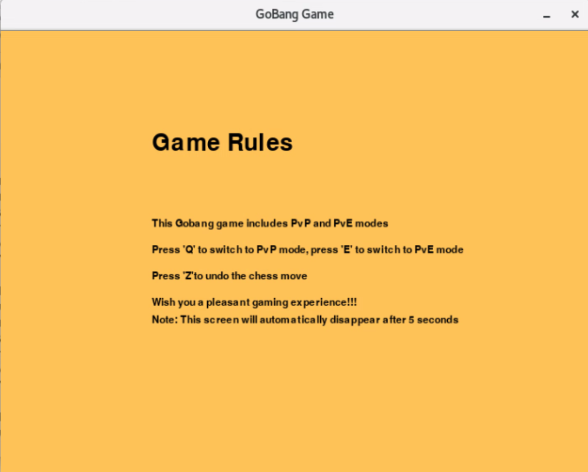
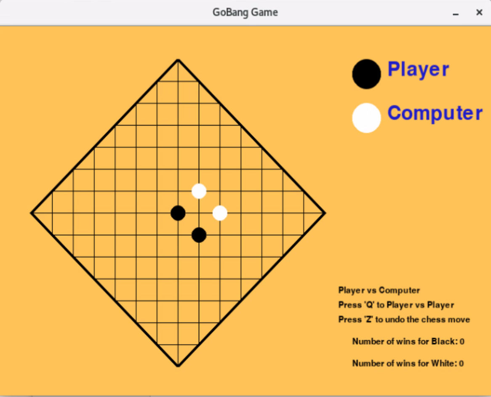

# Gobang Game with Pygame

## Environment Setup
Ensure you have the following environment before starting:
- **pygame:** version 2.5.2 (SDL 2.28.4)
- **Python:** version 3.8.16

## File Structure
- **board.py:** Contains logic and functions related to the game board.
- **machine.py:** Logic for the computer's gameplay.
- **main.py:** The main script to start and manage the game.

## Running the Game
To play the game, navigate to the game directory and run:
`python main.py`
Upon running, you'll be presented with an introductory screen.

## Game Overview
This Gobang game is primarily built using Python's `pygame` library. It offers two modes - Player vs Player (PvP) and Player vs Machine (PvE).

On the game's initial interface, there's a 5-second rule introduction. After this short duration, it will automatically switch to the Player vs Machine mode. Players can:
- Press `Q` to switch to the Player vs Player mode.
- Press `E` to return to the Player vs Machine mode.

Throughout the gameplay, the program keeps a record of accumulated wins for both black and white pieces, enhancing the gaming experience. 

In the player vs machine interface, pressing `Z` allows players to undo their last move.

